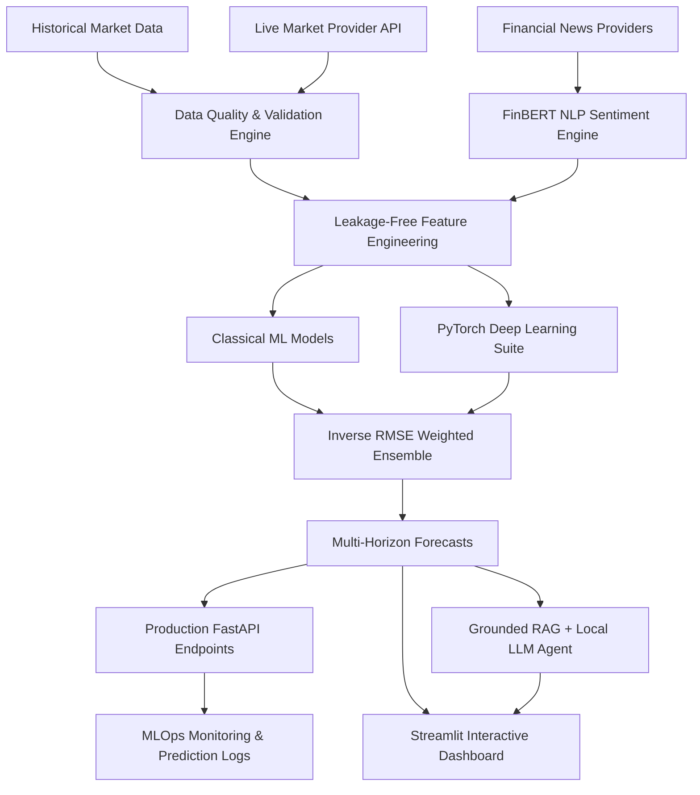

# SENTI MARKET INTELLIGENCE

A production-grade multi-market financial intelligence and multi-horizon forecasting platform combining historical market data, live quote ingestion, technical feature engineering, FinBERT NLP sentiment analysis, time-series classical ML, PyTorch deep learning, ensemble forecasting, RAG knowledge retrieval, local LLM reasoning, and MLOps monitoring.

---

## Key Features

- **Multi-Market Equity Coverage**: Supports US (`AAPL`, `MSFT`), Indian (`RELIANCE.NS`), and UAE (`EMAAR.AE`) equity markets.
- **Data Quality & Freshness Engine**: Validates price bounds, OHLC constraints, volume rules, and timestamps, calculating latency metrics (`latency_ms`) and flagging `STALE` status if age > 300s.
- **Leakage-Free Feature Engineering**: 57 technical indicators (RSI, MACD, Bollinger Bands, ATR, Volatility, Regimes) and 18 FinBERT aggregate sentiment features enforcing strict temporal alignment ($\text{published\_at} \le T$).
- **PyTorch Deep Learning & Ensembling**: 3D Sequence Tensor construction $[N, sequence\_length, F]$, training PyTorch MLP, LSTM, Temporal CNN, and Transformer models, combined via performance-weighted inverse validation RMSE.
- **Multi-Horizon Forecasting**: Simultaneous return predictions and target prices for 1-day, 3-day, 5-day, and 7-day forward horizons.
- **RAG Knowledge Base**: Local dense vector embeddings (`sentence-transformers/all-MiniLM-L6-v2`) and persistent vector store (`artifacts/vector_db/`) supporting semantic search.
- **Grounded AI Analyst**: `MarketAnalystAgent` leveraging local Ollama LLMs (`llama3.2`, `mistral`) with offline rule-based fallback, providing hallucination-free explanations with source citations.
- **Production FastAPI REST Endpoints**: `/health`, `/health/ready`, `/market/{symbol}`, `/prediction/{symbol}`, `/sentiment/{symbol}`, `POST /analysis`.
- **MLOps Audit & Drift Monitoring**: Logs predictions to JSONL, tracks realized return errors upon target horizon expiry, detects feature distribution drift, and manages 4-stage model promotion (`CANDIDATE` $\to$ `VALIDATED` $\to$ `APPROVED` $\to$ `PRODUCTION`).

---

## System Architecture



---

## Technology Stack

- **Core Logic & Data Processing**: Python 3.13, Pandas, PyArrow, NumPy, Pydantic v2
- **Financial & Market Data**: yfinance, ta (Technical Analysis Library)
- **Natural Language Processing**: Hugging Face Transformers, PyTorch, FinBERT (`ProsusAI/finbert`)
- **Machine Learning**: Scikit-Learn, XGBoost, Joblib
- **Deep Learning**: PyTorch (`torch.nn`, `torch.optim`)
- **RAG & Vector Search**: Sentence-Transformers (`all-MiniLM-L6-v2`), ChromaStore (NumPy Cosine Vector Store)
- **API & Application Layer**: FastAPI, Uvicorn, Streamlit, Requests, HTTPX
- **Containerization**: Docker, Docker Compose

---

## Project Structure

```text
senti-market/
├── api/                        # Production FastAPI web application
│   ├── routes/                 # Health, Market, Prediction, Sentiment, Analysis routers
│   ├── dependencies.py         # Dependency injection providers
│   ├── main.py                 # App entry point & CORS configuration
│   └── schemas.py              # Pydantic request/response DTOs
├── artifacts/                  # Persisted models, experiments, predictions, vector storage
├── config/                     # Application settings & logging configuration
├── data/                       # Ingestion, validation, storage, knowledge base docs
│   ├── builder/                # Historical dataset builder
│   ├── knowledge_base/         # Markdown documentation for RAG indexing
│   ├── providers/              # Market provider abstraction & yfinance provider
│   ├── schemas/                # Market & provider metadata Pydantic schemas
│   ├── storage/                # Dual Parquet & JSON provenance storage manager
│   └── validation/             # Data quality validator
├── deep_learning/              # PyTorch deep learning suite
│   ├── models/                 # PyTorch MLP, LSTM, Temporal CNN, Transformer
│   ├── training/               # PyTorchTrainer, EarlyStopping, CheckpointManager
│   ├── datasets.py             # PyTorch Dataset wrapper
│   ├── ensemble.py             # Performance-weighted inverse RMSE forecaster
│   ├── schemas.py              # Sequence & ensemble Pydantic schemas
│   └── sequence_builder.py     # 3D sequence tensor builder
├── docs/                       # Project architecture & pipeline documentation
├── features/                   # Technical indicator engineering & leakage validation
├── llm/                        # Ollama provider, prompt templates, MarketAnalystAgent
├── models/                     # Time-series splitters, preprocessors, classical ML registry
├── news/                       # News ingestion, deduplication, FinBERT sentiment pipeline
├── prompts/                    # Versioned prompt text templates
├── rag/                        # Document loader, text splitter, embeddings, retriever, pipeline
├── services/                   # Live market, news update, feature update, inference, MLOps
├── tests/                      # Pytest unit & integration test suite
├── app.py                      # Streamlit interactive web dashboard
├── Dockerfile                  # Production container image configuration
├── docker-compose.yml          # Microservice orchestration configuration
├── requirements.txt            # Python dependencies
└── README.md                   # Production documentation
```

---

## Installation

### Prerequisites
- Python 3.13+
- Docker & Docker Compose (optional, for containerized execution)

### Setup Instructions

```bash
# 1. Clone Repository
git clone https://github.com/BeU2177/senti-market-intelligence.git
cd senti-market-intelligence

# 2. Create Virtual Environment
python -m venv venv

# Activate on Windows:
venv\Scripts\activate
# Activate on Linux/macOS:
source venv/bin/activate

# 3. Install Dependencies
pip install -r requirements.txt

# 4. Configure Environment Secrets
cp .env.example .env
```

---

## Running the Project

### 1. Launch FastAPI Backend Server
```bash
uvicorn api.main:app --port 8000
```
- Interactive Swagger OpenAPI Docs: [http://localhost:8000/docs](http://localhost:8000/docs)
- ReDoc API Docs: [http://localhost:8000/redoc](http://localhost:8000/redoc)

### 2. Launch Streamlit Interactive Dashboard
```bash
streamlit run app.py
```
- Access Dashboard: [http://localhost:8501](http://localhost:8501)

### 3. Launch via Docker Compose
```bash
docker-compose up --build -d
```

---

## API Endpoints

- `GET /health` — Service status, version, and server timestamp.
- `GET /health/ready` — Readiness probe checking vector store and LLM endpoint status.
- `GET /market/{symbol}` — Real-time quote, price high/low/close, volume, and data freshness metrics.
- `GET /prediction/{symbol}` — Multi-horizon predictions ($1d, 3d, 5d, 7d$), ensemble weights, and confidence level.
- `GET /sentiment/{symbol}` — FinBERT sentiment probabilities, article count, and headline feed.
- `POST /analysis` — Grounded AI analyst response for query intent.

---

## Testing Suite

Run full automated test suite using `pytest`:
```bash
python -m pytest
```

64 unit and integration tests covering:
- Data quality validation & Parquet storage
- Technical feature calculations & leakage tests
- FinBERT NLP sentiment probabilities
- Classical ML regressors & walk-forward splitting
- PyTorch deep learning models & 3D sequence tensors
- Ensemble blending & confidence scoring
- RAG document loading, embeddings & vector retrieval
- Local LLM provider & fallback reasoning
- FastAPI endpoints & MLOps prediction logging

---

## Security Practices

- **Zero Hardcoded Secrets**: All API keys and credentials are read securely via `pydantic-settings` from `.env`.
- **Git Protection**: `.env` and local cache directories are strictly excluded in `.gitignore`.
- **API Masking**: Exception handlers mask raw stack traces in production HTTP responses.

---

## Limitations & Risk Disclaimer

- **Probabilistic Predictions**: All model forecasts ($1d, 3d, 5d, 7d$) are probabilistic statistical estimates and carry inherent market variance.
- **Not Financial Advice**: The system is designed strictly for quantitative research, market intelligence, and education. It does not provide financial advice or guarantee trading profits.
- **Provider Delays**: Polling-based market data from public endpoints carries standard exchange delays (15+ minutes).
- **Execution Excluded**: Automated trading, brokerage integration, and live order placement are intentionally excluded.
