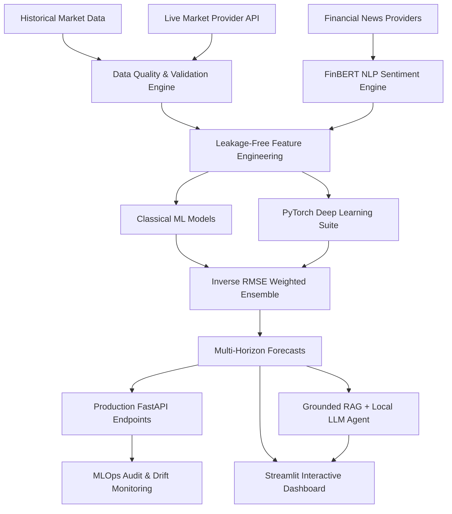

# System Architecture — Senti Market Intelligence

## Overview

Senti Market Intelligence is a production-grade multi-market financial forecasting and AI analysis platform. The platform ingests market price bars (US, Indian, UAE equities), processes financial news with FinBERT NLP sentiment analysis, constructs leakage-free technical features, trains time-series classical ML and PyTorch deep learning models, computes multi-horizon return forecasts ($1d, 3d, 5d, 7d$), and provides grounded AI market analysis using a local RAG vector store and Ollama LLM reasoning.

## Architecture Diagram

## Data Flow & Layer Responsibilities

1. **Ingestion & Quality Layer (`data/`)**: Fetches market bars, checks price bounds, OHLC constraints, volume rules, and timestamps, saving dual-layer Parquet datasets (`raw/`, `processed/`).
2. **Feature Engineering Layer (`features/`, `news/`)**: Computes 57 technical features and 18 FinBERT aggregate sentiment features enforcing temporal alignment ($\text{published\_at} \le T_{\text{bar}}$).
3. **Forecasting Layer (`models/`, `deep_learning/`)**: Chronologically splits datasets ($70\% / 15\% / 15\%$), fits scalers strictly on training data, builds 3D sequence tensors $[N, sequence\_length, F]$, and trains PyTorch MLP, LSTM, Temporal CNN, and Transformer models.
4. **Ensemble & Confidence Layer**: Blends forecasts using performance-weighted inverse validation RMSE and computes non-fabricated sign agreement confidence scores.
5. **RAG & Reasoning Layer (`rag/`, `llm/`)**: Indexes financial knowledge docs into local vector storage (`sentence-transformers/all-MiniLM-L6-v2`) and passes grounded context to local Ollama LLMs.
6. **API & Interface Layer (`api/`, `app.py`)**: Production FastAPI REST endpoints and Streamlit dashboard.
